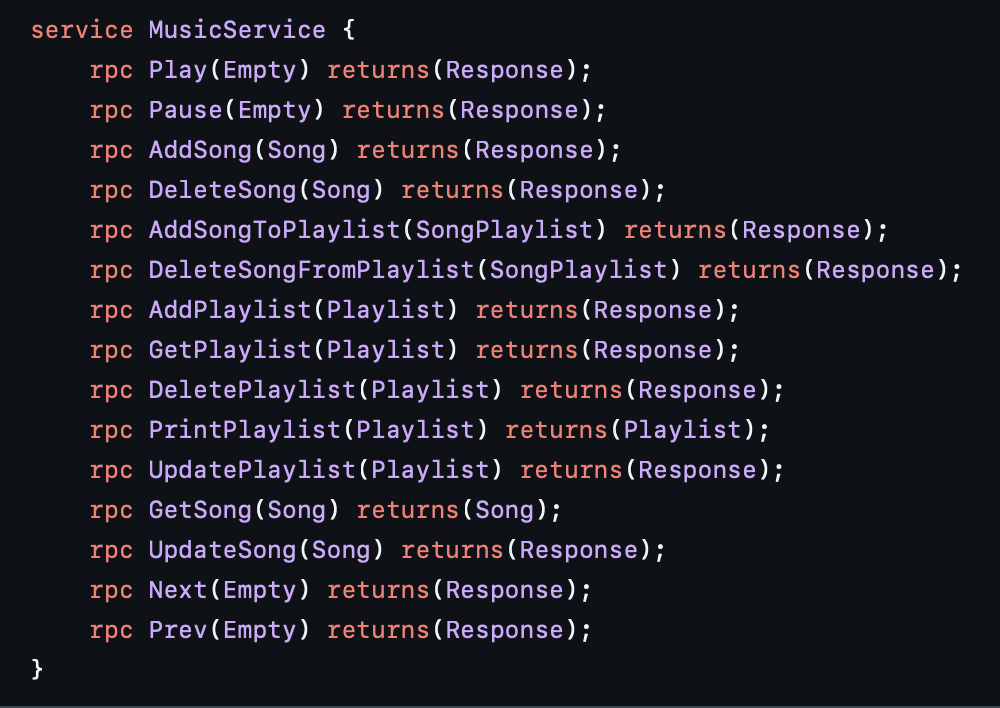

# Описание
* Музыкальный сервис - сервис, который предоставляет музыкальные плейлисты и API по взаимодействию с ними. Вся информация по трекам и плейлистам хранится в Postgres. Реализована связь many2many. Серверная часть реализована на grpc.

* Реализация клиента - https://github.com/gremislaw/music_service_client

* Получить API можно так - 
```golang
import github.com/gremislaw/music_service/api
```

# Функционал
* Получение плейлиста
* Запуск плейлиста
* Пауза плейлиста
* Создание трека
* Обновление трека
* Удаление трека
* Создание плейлиста
* Добавление и удаление треков в плейлисте
* Удаление плейлиста
* Вывод треков в плейлисте

# Использование API



# Запуск проекта
```bash
make docker
```

# Форматирование кода (стиль кода)
```bash
make format
```

# Конфигурация сервиса

|          | Database    | Server      |
|----------|-------------|-------------|
|   Port   |     5432    |     9000    |
|  Address | 192.168.1.3 | 192.168.1.2 |
|   Name   |   playlist  |             |
|   User   |      go     |             |
| Password |      go     |             |
